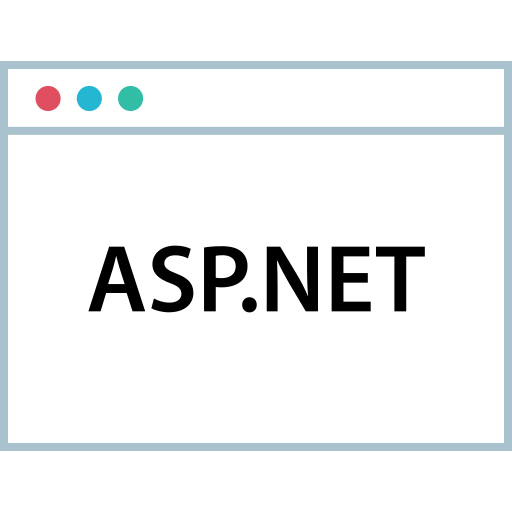

# Hello, I'm João Vitor 👋

[🇺🇸 English](#english-version) | [🇧🇷 Português](#versão-em-português)

---

## English Version

🎓 Student in Systems Analysis and Development  
🎯 Open to Work

---

## Contact

  

---

## Languages & Tools 

  
  
  
  
  
  
  
  

---

## Main Projects

###  [The Office](https://github.com/joaoalmei/pmv-ads-2024-2-e4-proj-infra-t5-the-office-1)

> **The Office** is a human resource management system designed to centralize and streamline HR processes like time tracking, vacation requests, payslip access, and viewing the company’s organizational chart.  
>  
> It aims to improve efficiency, transparency, and internal communication for both managers and employees.

###  [Atelier da Costura](https://github.com/ICEI-PUC-Minas-PMV-ADS/pmv-ads-2025-1-e5-proj-empext-t5-atelier-da-costura)

> A socio-technical system developed for a small tailoring business. It manages orders, customers, and expenses, and integrates with WhatsApp for automated communication.  
>  
> The platform includes features like financial and operational dashboards and customer/order management.

---

### Thanks for visiting! 😊

---

## Versão em Português

🎓 Estudante de Análise e Desenvolvimento de Sistemas  
🎯 Em busca de oportunidades

---

## Contato

  

---

## Linguagens e Ferramentas 

  
  
  
  
  
  
  
  

---

## Projetos principais

###  [The Office](https://github.com/joaoalmei/pmv-ads-2024-2-e4-proj-infra-t5-the-office-1)

> **The Office** é um sistema de gestão de recursos humanos que centraliza processos como controle de ponto, solicitação de férias, acesso a holerites e visualização do organograma.  
>  
> Ele visa aumentar a eficiência, a transparência e a comunicação interna, atendendo tanto gestores quanto colaboradores.

###  [Atelier da Costura](https://github.com/ICEI-PUC-Minas-PMV-ADS/pmv-ads-2025-1-e5-proj-empext-t5-atelier-da-costura)

> Sistema sociotécnico para uma pequena empresa de costura, com funcionalidades de gestão de clientes, pedidos e despesas, além de integração com WhatsApp para automação da comunicação.

---

### Obrigado pela visita! 😊
